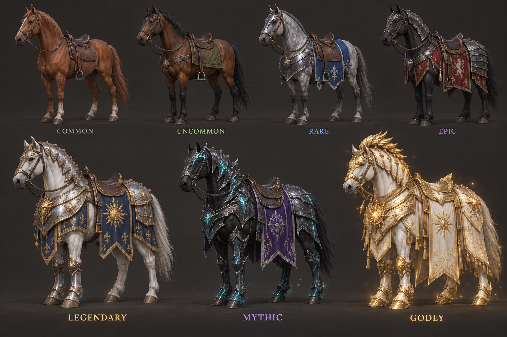

# Royal stables — Oathfire 2.21

The siege road is halved again, from 945 m to 472.5 m between gates. Camps, side objectives, reinforcements and old suspended saves move with the road. Enemy fortress health and reinforcement rosters are unchanged. Persistent battle objectives are collapsed into an edge flag: tap to inspect, close to hide. Quick steel strikes, heavy steel strikes and arrows striking armor use separate layered recordings.

## Riding contracts

Defense XII brings Orrin's royal herd to Hearthwatch. Visit him at the stables to inspect and hire a horse. Contracts are permanent and use Supplies, never real money or battle Command. Later tiers require further main-defense victories. The menu shows the actual animated horse, rarity, price, health, armor, speed and bonus before purchase.

| Horse | Tier | Defenses completed | Supplies | Health | Speed | Armor | Scale | Bonus |
|---|---|---:|---:|---:|---:|---:|---:|---|
| Hearthland Courser | Common | 12 | 2,400 | 320 | 8.1 m/s | 8 | 100% | Mounted attacks and obstacle jumping |
| Marchland Ranger | Uncommon | 13 | 4,000 | 420 | 8.6 m/s | 14 | 102% | +12% stamina recovery |
| Stormgray Charger | Rare | 15 | 6,500 | 540 | 9.0 m/s | 23 | 106% | Horse takes 18% less projectile damage |
| Crimson Dreadmane | Epic | 17 | 9,800 | 680 | 9.4 m/s | 34 | 109% | +15% mounted melee damage |
| Suncrest Destrier | Legendary | 19 | 14,500 | 850 | 9.8 m/s | 46 | 117% | +25% charged melee damage |
| Nightstar Colossus | Mythic | 21 | 21,500 | 1,040 | 10.3 m/s | 58 | 124% | +18% spell damage |
| Dawn Sovereign | Godly | 23 | 31,000 | 1,320 | 10.8 m/s | 72 | 130% | Rider takes 20% less damage; +30% charged melee |

Stop on clear ground and tap Mount/Dismount, or press H. The existing movement, jump, guard, weapon and ability controls still apply. Mounting is refused during attacks, charging, guarding, movement or in cramped spaces. A horse takes its share of incoming damage after its armor calculation; the rider also takes damage. At zero horse health, the rider dismounts. Re-mounting and reloading do not heal it. Returning to Hearthwatch restores the herd.

The horse has a kinematic body and fore/hind collision probes, acceleration, turning, gravity, ground contact and obstacle sliding. The rider's pelvis follows the saddle while the upper body aims. Melee attacks sweep down; projectiles launch at hand height. First-person camera placement follows the rider's head socket. These are gameplay character-controller physics, not a physically simulated animal skeleton.

## Art direction and implementation

This is the original design target, not a gameplay screenshot. Chestnut leather becomes olive quilt, blue steel, crimson dark plate, then larger silver/navy, violet/cyan and ivory/gold warhorses. The real-time models use continuous anatomical surfaces, articulated leg chains, facial details, bridles/reins, stitched leather, curved barding, rivets, heraldry and glowing seams. Mythic has additional flank plates; Godly adds long ornamental caparison panels. The generated sheet remains more detailed than the playable models; concept fidelity is not claimed to be exact.

Independent review prompted three iterations: correct the dark preview and mobile CTA; fix the first-person eye position, horse nose collisions and rider pelvis; then refine plate shading, muzzle, blanket intersections, saddle shape and top-tier armor. Runtime screenshots and reports are in `work/qa-mounts` and `work/qa-mount-review`.

## Research and sources

- [Rapier character controllers](https://rapier.rs/docs/user_guides/javascript/character_controller/): movement correction, slopes, autostep and ground snap. The installed 0.19 API was checked; the website may document a newer version.
- [Rockstar GDC overview: believable horses](https://gdcvault.com/play/1027230/AI-Summit-Making-the-Believable): animation, responses and animal behavior inform the approach. Only the public overview was available; the full presentation was not reviewed.
- [USDF: How Many Gaits Are There?](https://www.usdf.org/EduDocs/The-Horse/HowManyGaitsAreThere_2007_Jan.pdf): gait reference. The authored canter groups the diagonal pair into a shared beat; contacts drive hoof sound playback.
- [Quaternius animal pack](https://quaternius.com/packs/ultimateanimatedanimals.html) was evaluated but not used. All player-horse geometry is authored in this repository.
- [StarNinjas sword recordings](https://opengameart.org/content/20-sword-sound-effects-attacks-and-clashes), [Kenney impacts](https://kenney.nl/assets/impact-sounds), and [Peludo splashes](https://opengameart.org/content/water-splash-and-sand-footsteps), CC0. Exact source hashes and final cues are in `public/sfx/combat-v221-provenance.json`. No source-game audio was copied.

## Concept generation record

Mode: new image generation, opaque background, no reference images. One original sheet; subsequent iterations changed actual 3D geometry, materials, animation and layout. Output: `docs/art/horse-tiers-concept.png`.

Prompt:

> Use case: stylized-concept. Asset type: original Oathfire mobile 3D game production design sheet, seven RIDABLE HORSES, no riders. A polished wide 3D asset presentation on warm charcoal, arranged as four horses across the top and three larger warhorses across bottom, each fully visible including four legs, ears and tails, left-facing three-quarter side views. Consistent anatomically believable adult horse proportions: strong chest and hindquarters, long equine head, slender cannon bones, clear hocks and fetlocks, broad hooves, realistic mane and tail. Textured mobile mid-poly game models with readable steel plates, leather straps, stitched saddles and stirrups, cloth caparisons; honest game-engine render quality, not a photographic painting. All horses are original. Labels below exactly: COMMON, UNCOMMON, RARE, EPIC, LEGENDARY, MYTHIC, GODLY. COMMON: chestnut, plain brown saddle and bridle, no armor. UNCOMMON: bay, quilted olive saddle blanket, leather chest straps. RARE: dapple gray with blue cloth, steel chamfron faceplate and chest armor. EPIC: black horse with crimson caparison and overlapping dark steel neck and rump plates. LEGENDARY: distinctly larger muscular white destrier, navy cloth with gold sun heraldry, complete silver-and-gold segmented barding, ornate crest. MYTHIC: larger obsidian destrier, violet velvet, angular dark silver barding, fine glowing cyan seams on armor, faint cyan sparks close to hooves. GODLY: largest ivory destrier, brilliant gold and ivory full barding, amber glowing sun medallion and fine luminous engravings, long ivory-gold caparison, restrained warm particles, feather-shaped metal crest but NO wings or horn. Materials should show coarse fabric, leather seams, brushed metal, rivets and bevels. Show increasing mass and ornament across tiers while retaining horse anatomy. Soft directional studio lighting and ground contact shadows. No marketing copy, no environment, no price tags.

## Validation scope

Unit tests cover contract gates, costs, ownership, damage/bonuses, injuries, save validation and siege migration. Isolated mobile browser playtests cover the visible purchase flow, mounting, collisions, jumping, spells/arrows, charged attacks, injuries, restoration and objective dismissal. Independent playtesting includes melee against live targets and side aiming. Browser tests use touch emulation; they are not a claim of physical iPhone testing.

Final release verification: 205 unit tests passed. Production Chromium reports: 26 checks in work/qa-mounts-production, 15 checks in work/qa-touch-v221, 27 checks in work/qa-frontline-v221. The independent reviewer completed three rounds and found no remaining functional blocker in the representative mounted playtests. Their final report preserves the remaining visual-fidelity limits.

Sound manifests use a release-specific online request so a waiting older service worker cannot hide the updated combat sounds. Offline startup falls back to the precached manifest; both update paths have regression coverage.
